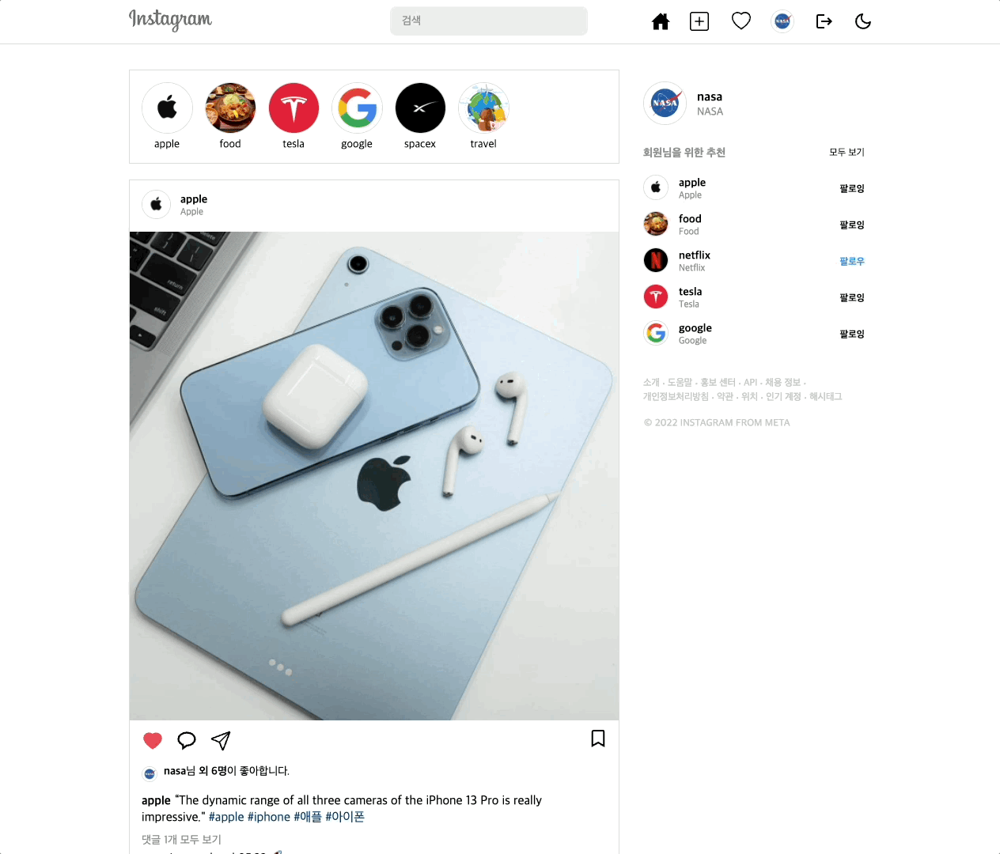
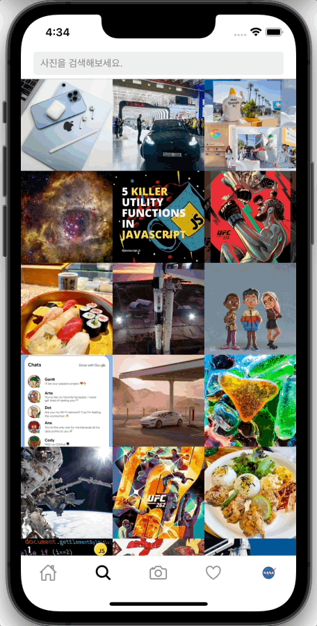

  <a href="https://kidsgram.netlify.app">
    
      
    <a display="block" href="https://kidsgram.netlify.app">https://kidsgram.netlify.app</a>
      
    
  </a>

## Table of contents

- 🔥 [Built with](#built-with)
- 🌈 [Project](#project)
- 📑 [Pages](#pages)
- ⚙ [Features](#features)
- 📝 [License](#license)

## Built with

### Front-end

- `React`
- `Typescript`
- `Apollo Client`
- `Framer Motion`
- `Styled Components`
- `GraphQL Code Generator`

### Back-end

- `NodeJS`
- `Express`
- `Apollo Server`
- `GraphQL`
- `PostgreSQL`
- `Prisma`
- `JsonWebToken`

### App

- `React Native`
- `Expo`
- `Typescript`
- `Apollo Client`
- `React Navigation`
- `Styled Components`
- `GraphQL Code Generator`

### Deploy

- `Netlify`
- `Heroku`
- `AWS S3`

## Project Overview

-This project aims to implement the primary features of Instagram, including taking photos, uploading, feeds, searching, liking, following, notifications, and messaging. It encompasses the entire coding of Instagram, including backend, frontend, app, and server. Additionally, the Amazon S3 API is used for storage roles, such as uploading and deleting photos. Technologies used in this project include NodeJS, ES6, Apollo Server, Prisma Client, Prisma Migrate, Prisma Studio, React, Apollo Client, React Hooks, Expo, React Native CLI, React Native, React Navigation, Heroku, and Netlify.

## Project

> 1. Sign up, Log in, Log out

- Users can sign up by entering their email, full name, username, and password.
- Upon registration, the entered password is hashed using Bcrypt, and the account information is stored in PostgreSQL.
- Users can log in by entering their username and password.
- Upon successful login, users receive a JsonWebToken, which is then stored in local storage.
- The local state is updated using Apollo Client's Reactive variables.
- Updating the Reactive variables triggers an update of all queries that depend on the variable.
- When logging out, change the Reactive variables, remove the token stored in local storage, and clear the data stored in the store.
    
  

> 2. Profile

- On the profile page, you can view user information, photos, followers, and followings.
- Followers are the list of users who follow the target user, while followings are the list of users whom the target user follows.
    
  

> 3. Follow and Unfollow Users

- Users can follow or unfollow other users.
- Upon following or unfollowing, the Apollo Client is used to directly modify the cached field values for both the target user and oneself, updating the followers and followings lists accordingly.
- When a user is followed, their uploaded photos become visible on the home page.
    
  

> 4. Search Users and Hashtags

- Users can be searched using @username (e.g., @nasa).
- Hashtags can be searched using #hashtag (e.g., #space).
- Using React Hook Form, users are searched with @username input, and hashtags are searched with #hashtag input.
    
  

> 5. Photos

- Click on a photo to view its details.
- Framer Motion is used to apply animations when the modal window appears or disappears.
- Users can view the uploader, caption, comments, and likes for each photo.
- Users can see who liked the photo, and follow or unfollow these users.
- Users can write, edit, or delete comments on photos.
- The user who uploaded the photo can edit the caption or delete the photo. 
    
  

> 6. Photo Upload

- Users can upload photos by selecting an image and entering a caption.
- In the caption, users can include @username or #hashtag to mention usernames or hashtags.
- Uploaded photos are saved in an AWS S3 bucket.
    
  

> 7. Like and Unlike Photos

- Users can like or unlike photos.
- Upon liking or unliking a photo, the Apollo Client is used to directly modify the cached field values of the photo to update the number of likes and total likes. 
    
  

> 8. Hashtags

- Hashtags display all photos associated with the particular hashtag.
- When uploading a photo, if you enter #hashtag in the caption, a new hashtag is created.
    
  

> 9. Follow Update

- With GraphQL Subscriptions, users can receive real-time follow update notifications when someone follows them.
- Using PubSub, when a user follows another, an event is published, and users listening to that event receive follow update notifications. 
    
  

> 10. Dark Mode

- Click on the sun and moon icons to toggle between light mode and dark mode.
- Using Styled Components' ThemeProvider, set up light and dark themes.
- When switching to dark mode, store the dark mode activation status in local storage, and update the local state using the Apollo Client's Reactive variables.
    
  

> 11. Sign up, Log in, Log out (App)

- Users can sign up by entering their email, full name, username, and password.
- Users can log in by entering their username and password.
- Upon successful login, users receive a JsonWebToken, which is then stored in the AsyncStorage.
- When the app loads, verify the login status by retrieving the token from AsyncStorage.
- When logging out, change the Reactive variables, remove the token stored in AsyncStorage, and clear the data stored in the store.
    
  
  

> 12. Profile (App)

- On the profile page, you can view user information, photos, followers, and followings.
- Click on a photo to view its details.
- Users can view the uploader, caption, comments, and likes for each photo.
    
  
  

> 14. Photo Search, Photo Selection, and Photo Capture (App)

- Photos can be searched by caption (e.g., food).
- Users can upload photos from their phone's album or take new photos using the camera.
- expo-media-library is used to set access permissions for the media library.
- expo-camera is used to configure camera settings such as type, zoom, ratio, and white balance.
    
  
  

> 15. 기타

- The Front-end will be deployed on Netlify, and the Back-end is deployed on Heroku.
- The Database will be deployed on Heroku PostgreSQL.
- GraphQL Code Generator is used to generate types and code from the GraphQL Schema.
- `Front-end`: https://github.com/hoiwonkim/kidsgram-app
- `Back-end`: https://github.com/hoiwonkim/kidsgram-backend

## Pages

> Root

- 홈
- 로그인
- 회원가입

> User

- 전체 유저
- 유저 프로필
- 유저 팔로우
- 유저 팔로워
- 프로필 수정

> Photo

- 사진 업로드
- 사진 상세정보

> Hashtag

- 해시태그

## Features

### 🙎‍♂️ User

- [x] 회원가입, 회원탈퇴
- [x] 로그인, 로그아웃
- [x] 프로필 보기
- [x] 팔로우, 언팔로우
- [x] 팔로워, 팔로우 보기
- [x] 유저 검색
- [x] 프로필 수정
- [x] 전체 유저 보기
- [x] 팔로우 업데이트

### 📷 Photo

- [x] 사진 보기
- [x] 사진 좋아요 보기
- [x] 사진 업로드
- [x] 사진 수정
- [x] 사진 삭제
- [x] 사진 검색
- [x] 피드 보기

### 💬 Comment

- [x] 댓글 보기
- [x] 댓글 생성
- [x] 댓글 수정
- [x] 댓글 삭제
- [x] 댓글 업데이트

### #️⃣ Hashtag

- [x] 해시태그 보기
- [x] 해시태그 검색

### ❤️ Like

- [x] 사진 좋아요, 좋아요 취소
- [x] 좋아요 업데이트

### 📨 Room

- [x] 전체 채팅방 보기
- [x] 채팅방 보기

### ✉️ Message

- [x] 메세지 보내기
- [x] 메세지 읽기
- [x] 메세지 삭제
- [x] 메세지 업데이트

## License

MIT

# Getting Started with Create React App

This project was bootstrapped with [Create React App](https://github.com/facebook/create-react-app).

## Available Scripts

In the project directory, you can run:

### `npm start`

Runs the app in the development mode.\
Open [http://localhost:3000](http://localhost:3000) to view it in the browser.

The page will reload if you make edits.\
You will also see any lint errors in the console.

### `npm test`

Launches the test runner in the interactive watch mode.\
See the section about [running tests](https://facebook.github.io/create-react-app/docs/running-tests) for more information.

### `npm run build`

Builds the app for production to the `build` folder.\
It correctly bundles React in production mode and optimizes the build for the best performance.

The build is minified and the filenames include the hashes.\
Your app is ready to be deployed!

See the section about [deployment](https://facebook.github.io/create-react-app/docs/deployment) for more information.

### `npm run eject`

**Note: this is a one-way operation. Once you `eject`, you can’t go back!**

If you aren’t satisfied with the build tool and configuration choices, you can `eject` at any time. This command will remove the single build dependency from your project.

Instead, it will copy all the configuration files and the transitive dependencies (webpack, Babel, ESLint, etc) right into your project so you have full control over them. All of the commands except `eject` will still work, but they will point to the copied scripts so you can tweak them. At this point you’re on your own.

You don’t have to ever use `eject`. The curated feature set is suitable for small and middle deployments, and you shouldn’t feel obligated to use this feature. However we understand that this tool wouldn’t be useful if you couldn’t customize it when you are ready for it.

## Learn More

You can learn more in the [Create React App documentation](https://facebook.github.io/create-react-app/docs/getting-started).

To learn React, check out the [React documentation](https://reactjs.org/).
